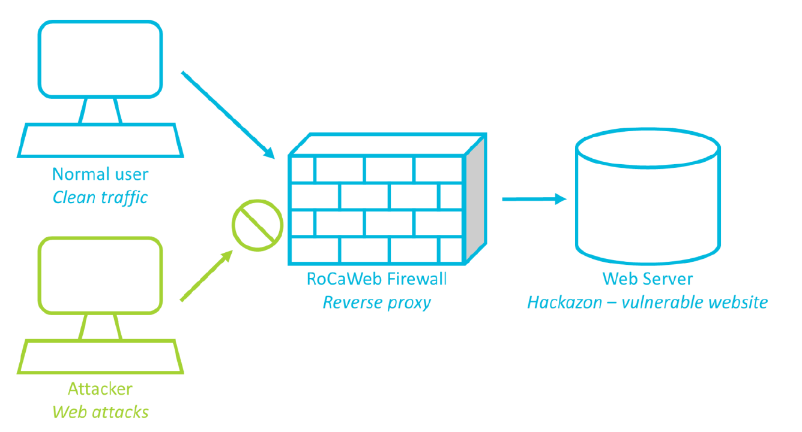
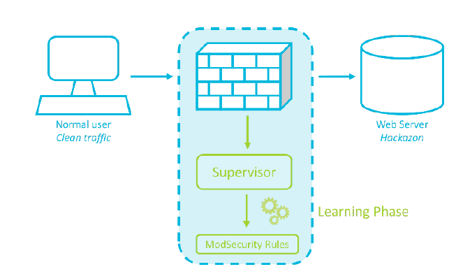
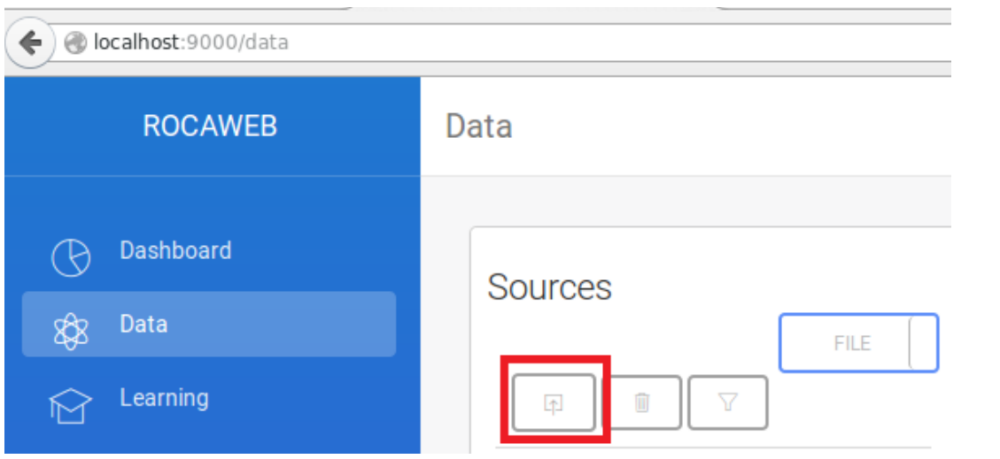
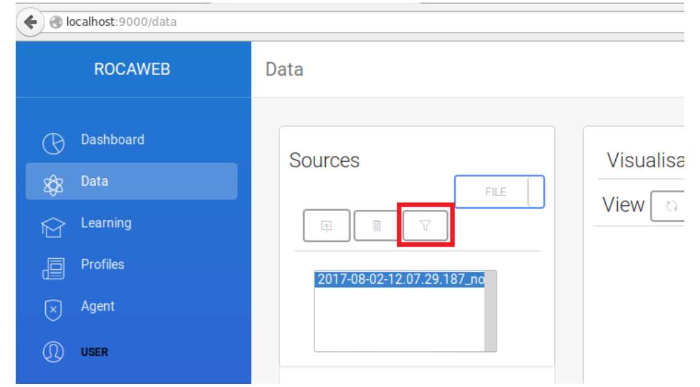
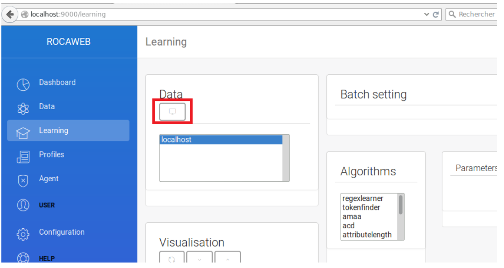
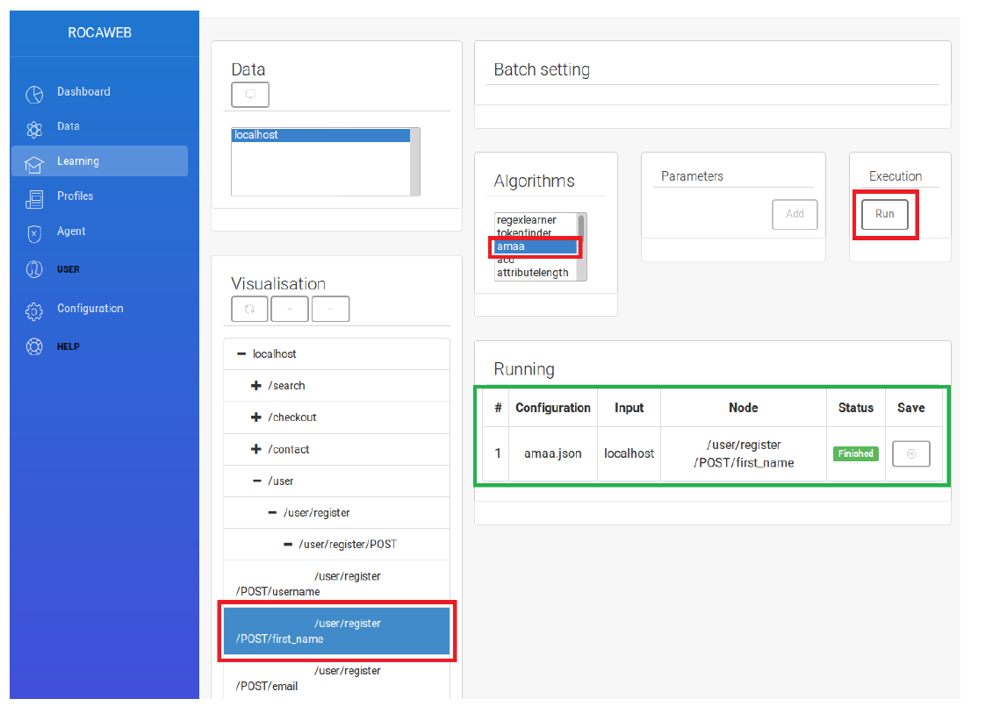
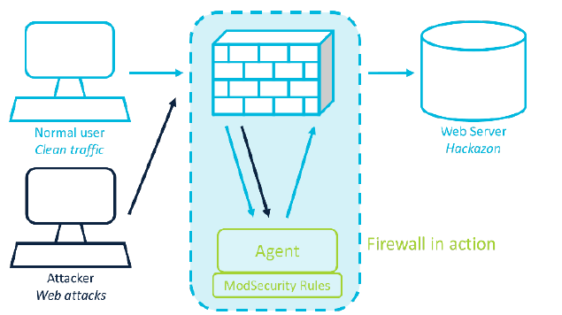

# RoCaWeb (Reverse Proxy based on Contract for Web protection)

## Introduction

RoCaWeb was a project between IMT-Atlantique (then Télécom-Bretagne) and [Keraval](http://kereval.com).
It was funded with grant called RAPID (régime d’appui à l’innovation duale). The project leads to the development of the software name RoCaWeb.

RoCaWeb is the descendant of other projects launch to study the application
of the notion of smart contract to Web application protection.
These projects are:
  - [DALI](http://dali.kereval.com/)
  - DIDON
 

## Web application Firewall

As defined by OWASP: "A web application Firewall (WAF) is an application Firewall for HTTP applications.
It applies a set of rules to an HTTP conversation. Generally, these rules cover common attacks such as cross-site scripting (XSS) and SQL injection."
On such application is ModSecurity. A WAF can be deploy as reserve proxy to filter all the traffic. It can also function as:

    - passive mode also known as IDS
    - active mode also known as IPS


## The chosen approach in the RoCaWeb project

RoCaWeb is composed by three modules: 

    - Learning
    - Web User Interface
    - Agent
An illustration of RoCaWeb protecting Hackazon is swhon on the figure below. 



### Learning

The RoCaWeb Learning module is illustrated on the following figure:


### Data sets used for the learning process
An important remark is that: We are assuming that the data sets used for the learning 
process describe the ** normal behavior ** of the application. 
These data can be obtained using:

    - Wireshark to capture a normal traffic and then export it as a PDML
    - the ELK stack (provided in a beta version). 
Other data sources can be also implemented. 

### Algorithms implemented
The learning component is composed by the following algorithms: 

- Bio-informatic algorithms:
    - AMAA (Another Multiple sequence Alignment Algorithm). This algorithm was developed during this project. 
    - CSR (Contiguous Substring Reward)
    - Needleman-Wunsch
    - Smith-Waterman

- Grammatical algorithms:
    - Trie
    - Dictionary methods
    - Probabilistic grammar inference


- Statistical algorithms
    - Chebychev test
    - Chi-squarre
    - etc.
  
- Machine learning
    - Naive Bayesian
    - Once class SVM
    - Decision trees
    - etc.


These algorithms are implemented  in Java when a suitable version from a library is not used.


## Web User Interface
RoCaWeb offers a user interface developed using the Play Framework.
It allows the configuration of all the learning process and also the state of the rules.

### Generating firewall rules with Webui
We are now going to import the PDML file using Webui and then generate the firewall rules. Webui
can be accessed by connecting to http://localhost:9001 in a browser.
The Data page should be displayed, with three main blocks: sources, preprocessed, visualization. In
the sources block, we are going to import the PDML file, by clicking on the import icon.



Once the file is uploaded, it should appear in the sources window. We then need to clusterize the data:
to do so, we need to select the file in the sources window and click on the clusterize button:


Once the data is ready, it should appear in the preprocessed block:


We can now move on to the Learning page. We should see localhost in the data block. To visualize it,
we are going to select localhost and click on the visualization button:



We should now be able to see the details of our data in the visualization block. We are going to generate
a ModSecurity rule for the first_name parameter. So we can select /user/register/POST/first_name,
then the AMAA algorithm. Then let’s generate the rule by clicking on the Run button. In the running
block, we should see the information of what job is running. Once it is finished, the running block
should look like this (green border):




Once the job is finished, we can go to the Profiles page to download the rule. To do so, we just need
to select it and click on the import button. It is downloaded as a text file (.txt), so we will need to
change it to a .conf file by renaming it hackazon-first-name-amaa.conf (the name does
not really matter, the file just needs to be .conf).


## Agent

The agent is composed by ModSecurity, Torch7 and OSBF-Lua to provide the reverse-proxy.
The detection phase is illustrated on the figure below. 



# Installation 

## Using Docker

After downloading this repository, change to the docker directory and type

```bash
docker-compose up
```

This will launch the:

   - web user interface available at http://localhost:9001

   - hackazon vulnerable web site at http://localhost
   
   - Webgoat available at http://localhost:8080/WebGoat

   - two instances of the  agent (Apache/Modsecurity/Torch/OSBFLua) for Hackzon and Webgoat. Each functioning as a separate reverse proxy. 

   - ELK stack
   
      - Elasticsearch
      - Logstash 
      - Kibana is accessible at http://localhost:5601
     


## From this Git repository
After installing the dependencies, downloading this repository from Github by:

```bash
$ git clone https://github.com/dakountche/RoCaWeb.git rocaweb  
```

 Then change to the directory rocaweb and:

- Install the dependencies:
   - Java 8
   - Maven 3
   - Scala
   - SBT
   - Add the name of your machine to /etc/hosts
   - NodeJS and add the following to your .bashrc
   - Docker and docker-compose

```bash
$ export SBT_OPTS="${SBT_OPTS} -Dsbt.jse.engineType=Node -Dsbt.jse.command=$(which node)"
```
   
```bash
$ mvn clean install -DskipTests
```
We are skipping the tests from now. 

- Change to the webui folder and type:

```bash
$sbt run
```
This command will launch the web user interface. 


# Contributing to this project
RoCaWeb is still under development. And your contribution is welcome. 


# RoCaWeb Documentation

This documentation folder is divided into three subfolders: papers, presentations and reports.

## Papers

**Specification-based intrusion detection using Sequence alignment and Data clustering**
* Authors: Djibrilla Amadou Kountche, Sylvain Gombault
* Language: English
* Location: ```./documentation/papers/writen/fnss2015/```
* Abstract: In this paper, we present our work on specification-based intrusion detection. Our goal is to build a web application firewall which is able to learn the normal behavior of an application (and/or the user) from the traffic between a client and a server.
* Format: PDF, LaTeX

## Presentations

**Specification-based intrusion detection using Sequence alignment and Data clustering**
* Authors: Djibrilla Amadou Kountche, Sylvain Gombault
* Language: English
* Location: ```./documentation/presentations/fnss2015/```
* Abstract: 
* Format: PDF, LaTeX

**RoCaWeb: Choix algorithmiques et Questions d'implémentation**
* Author: Djibrilla Amadou Kountche
* Language: French
* Location: ```./documentation/presentations/jr2015/``` 
* Abstract: 
* Format: PDF, LaTeX

## Reports

**Manuel d'utilisation de RoCaWeb**
* Author: Team RoCaWeb
* Language: French
* Location: ```./documentation/reports/userGuide/```
* Abstract: Dans ce petit guide, nous allons expliquer le fonctionnement de la version courante de Rocaweb. Nous informons dès à présent le lecteur que RoCaWeb est toujours en développement. Il est à la version 3 sur quatre  prévues. 
* Format: LaTeX

